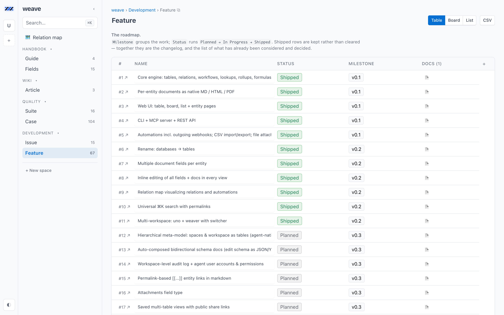
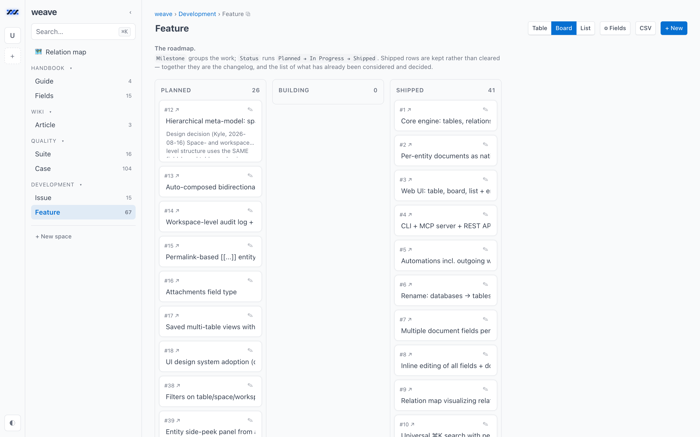
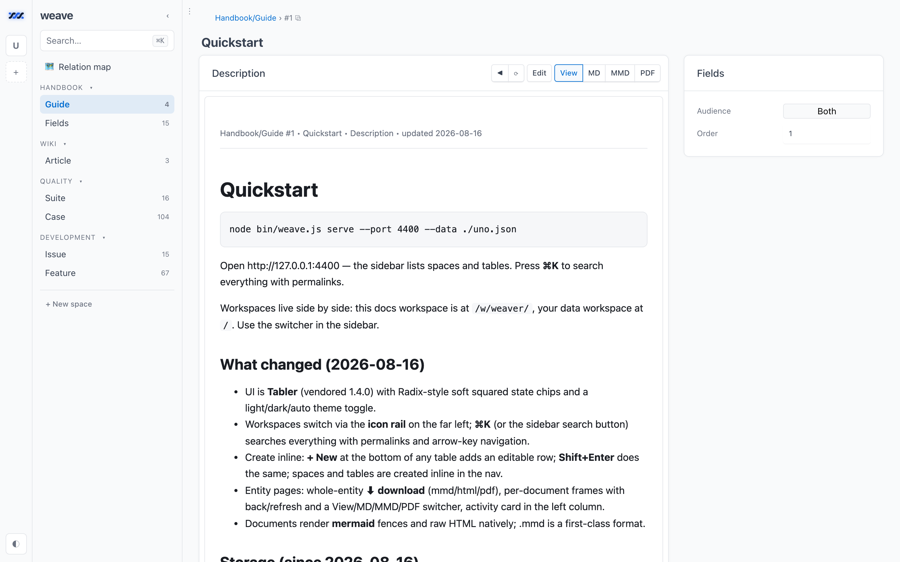
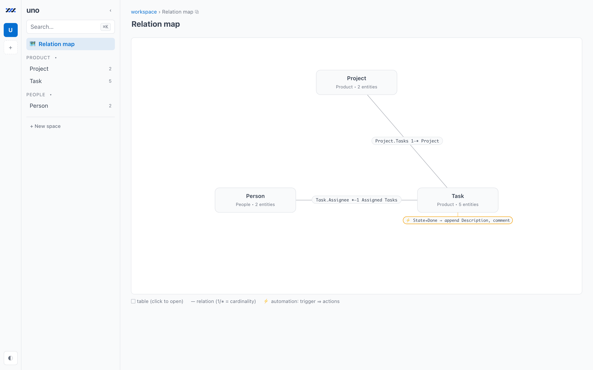
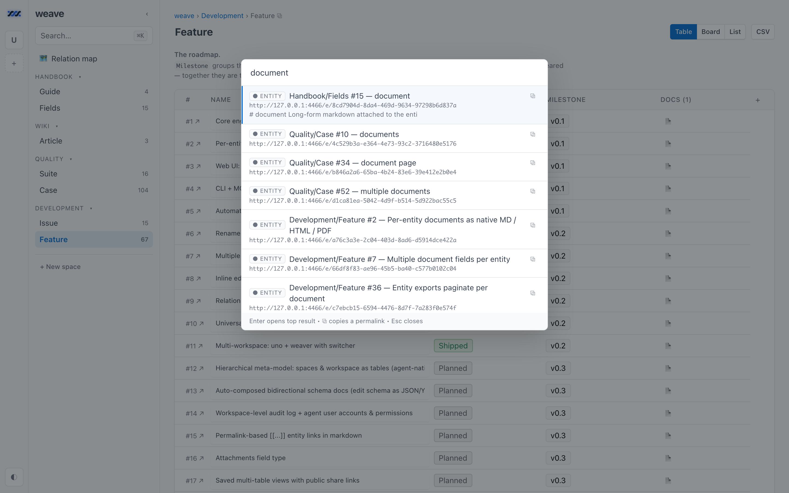

<p align="center">
  <picture>
    <source media="(prefers-color-scheme: dark)" srcset="brand/assets/png/weave-loader-dark.gif">
    
  </picture>
</p>

<h1 align="center">weave</h1>

<p align="center">
  <strong>An open-source, self-hosted alternative to Airtable, Fibery, Notion databases, and ClickUp —
  built so that AI agents are first-class users, not an afterthought.</strong>
</p>

<p align="center">
  Connected tables, relations, workflows, formulas, rollups, and per-entity markdown
  documents. One SQLite file. Zero dependencies. No build step. MIT.
</p>

<p align="center">
  <a href="LICENSE"></a>
  
  
  
  
</p>

<p align="center">
  <a href="#quickstart">Quickstart</a> ·
  <a href="#how-weave-compares">Comparison</a> ·
  <a href="#agents-mcp-rest-and-cli">Agents &amp; MCP</a> ·
  <a href="#self-hosting">Self-hosting</a> ·
  <a href="#faq">FAQ</a>
</p>

<p align="center">
  
</p>

---

## What weave is

weave is a **work platform you run yourself**: spaces hold tables, tables hold
entities, and entities connect to each other through real bidirectional
relations — with lookups, rollups, formulas, workflow states, automations, and
any number of markdown documents attached to each row.

It is meant to **replace the SaaS your work already lives in** — Airtable's
bases and grids, ClickUp's tasks and boards, Fibery's connected databases with
documents and automations — running on your laptop or your own server, with no
per-seat bill and no vendor holding the export button.

The difference from every other tool in this category is the second audience.
Work-management tools are built for humans first and APIs second. weave is built
for **humans and agents as equals**: everything the web UI can do, the REST API,
the CLI, and the built-in **MCP server** can do too — same engine, same data
file on your disk. No accounts, no cloud, no telemetry.

- **Local-first** — your workspace is one SQLite file next to your project.
- **Yours to host** — one Node process and one file; run it on a laptop or a
  small VPS behind your own TLS and login (see [Self-hosting](#self-hosting)).
- **Zero dependencies** — `git clone` and run. Storage is Node's built-in
  `node:sqlite`; the only third-party code is vendored and pinned.
- **Agent-native** — an MCP server any stdio client can mount (Claude Code,
  Codex CLI, Cursor, Gemini CLI), a scriptable CLI, `Table#12` refs
  everywhere, and markdown documents addressable as plain URLs
  (`/e/Task#12/doc.md`, `.html`, `.pdf`).
- **Undoable** — every entity mutation (edits, creates, deletes, links,
  comments) can be stepped back with `weave undo`, `POST /api/undo`, or the
  `weave_undo` MCP tool; agents get to make mistakes without making a mess.
- **Versioned documents** — every document field keeps its revisions (one
  per editing session), browsable and restorable from the page, `weave
  doc-revisions` / `weave doc-restore`, or the `weave_doc_revisions` /
  `weave_doc_restore` MCP tools.

## Quickstart

Requires **Node ≥ 22.16** (Node 24 LTS recommended). There is nothing to build
and nothing to install from npm.

```bash
git clone https://github.com/grunion-ai/weave
cd weave
node bin/weave.js serve --port 4400 --data ./my-workspace.db
```

Open http://127.0.0.1:4400 — press **⌘K** to search everything. A
self-documenting **weave** docs workspace is provisioned alongside your data at
`/w/weave/`: handbook, wiki, the public issue tracker and roadmap, and a
Quality space mirroring the test suite.

If weave replaces a SaaS seat for you, star the repo. Stars are how the agent
scouts and the directories find it.

## Connect your agent

One config block, any stdio MCP client (Claude Code, Claude Desktop, Codex CLI,
Cursor, Gemini CLI, Windsurf, OpenCode):

```json
{ "mcpServers": { "weave": { "command": "node",
  "args": ["/path/to/weave/bin/weave.js", "mcp", "--data", "/path/to/my-workspace.db"] } } }
```

Or add it to Claude Code in one line:

```bash
claude mcp add weave -- node /path/to/weave/bin/weave.js mcp --data /path/to/my-workspace.db
```

Fifty-one tools, the same undo the UI has, and `weave_vocabulary` so an agent
reads the allowed values instead of guessing. Full map:
[Agents: MCP, REST, and CLI](#agents-mcp-rest-and-cli).

## Screenshots

| Board view | Documents on every row |
| --- | --- |
|  |  |
| Workflow states become columns; drag or set state from any interface. | Every entity carries markdown documents, addressable as `.md`, `.html`, and `.pdf` URLs. |

| Relation map | Universal search |
| --- | --- |
|  |  |
| The schema, drawn: relations with cardinality, plus the automation layer. | ⌘K across every workspace, backed by SQLite FTS5, with copyable permalinks. |

## How weave compares

### Against the SaaS it replaces

| | **weave** | Airtable | ClickUp | Fibery |
| --- | --- | --- | --- | --- |
| License | MIT, open source | Proprietary | Proprietary | Proprietary |
| Where the data lives | A `.db` file you own | Vendor cloud | Vendor cloud | Vendor cloud |
| Pricing | Free — it's a repo | Per seat, per month | Per seat, per month | Per seat, per month |
| Row / record caps | Your disk | Plan-tiered | Plan-tiered | Plan-tiered |
| Agent access | MCP server + REST + CLI, all first-class | API + partner integrations | API + partner integrations | API + partner integrations |
| Runs offline | Yes | No | No | No |
| Telemetry | None | Vendor-defined | Vendor-defined | Vendor-defined |

### Against other open-source Airtable alternatives

The open-source options in this space are all worth a look, and several are far
more mature than weave. They differ mainly in what they optimize for:

| Project | License | Install shape | Optimized for |
| --- | --- | --- | --- |
| **weave** | MIT | One Node process, one file, no deps | Agent access, connected documents, disappearing into a repo |
| [NocoDB](https://github.com/nocodb/nocodb) | Sustainable Use License (since v0.301.0) | Docker + external DB | Putting a smart-spreadsheet UI on an existing MySQL/Postgres |
| [Baserow](https://github.com/baserow/baserow) | MIT (core; paid tiers separate) | Docker Compose + Postgres | A full Airtable-shaped product, cloud or self-hosted |
| [Grist](https://github.com/gristlabs/grist-core) | Apache-2.0 | Docker or Node | Spreadsheet-grade formulas and data analysis |
| [Teable](https://github.com/teableio/teable) | AGPL-3.0 (core) | Docker + Postgres | Postgres-native scale with an Airtable UI |

*Licenses and packaging as of August 2026 — check each project for current
terms.* Pick weave if you want **connected tables plus markdown documents plus
an MCP server, with no container, no database server, and no dependency tree**.
Pick one of the others if you need multi-user permissions, a hosted option, or a
mature plugin ecosystem — see [what weave is not](#what-weave-is-not).

## What's inside

| Area | Details |
| --- | --- |
| Data model | Spaces → tables → entities. Field types: text, number, date, date range, checkbox, toggle (a switch with two named states), url, email, select, multiselect, workflow states, bidirectional relations, lookups, rollups (count, sum, avg, median, min, max, range, stdev, distinct, filled, empty, join — over a relation, or over a whole table from the space's own row, which is what the grid footer draws), formulas, and any number of markdown document fields per entity. |
| Statistics | `weave stats <table>` (also `weave_stats` and `GET /api/tables/:ref/stats`): every column summarised — five-number summary, stdev and a histogram for numbers, ranked distributions for chips, earliest/latest/span for dates — grouped with `--by`, narrowed with `--where`. |
| Views | Table, board, list, entity pages, a relation map with the automation layer drawn in, and per-space/table filtering. Inline editing everywhere. |
| Documents | Every doc is a native URL: `.md`, `.mmd`, `.html`, `.pdf`. Mermaid diagrams, raw HTML and math render in place; `[[Table#12]]` mentions resolve to links. Whole-entity export paginates one page per document. Math is KaTeX only (`$…$` / `$$…$$`, vendored + offline); the other fence engines Vditor knows (graphviz, echarts, plantuml, mindmap, abc, flowchart) are deliberately not vendored, so those fences stay plain code blocks. |
| Automations | Triggers (created / field changed / state changed) → set field, append doc, add comment, outgoing webhook. |
| Search | Universal ⌘K across workspaces with copyable permalinks, backed by a SQLite FTS5 index. |
| Storage | One workspace = one `.db` file (WAL, row-level writes, crash-safe). Legacy JSON workspaces migrate automatically; `exportJSON`/`importJSON` remain the human-readable interchange. CLI, server, and MCP can run concurrently. |
| Interfaces | Web UI (vanilla JS, no build step) · REST API · CLI (`bin/weave.js`) · MCP server (`weave mcp`). |

## Agents: MCP, REST, and CLI

Every interface drives the same engine and the same file. Nothing is UI-only.

**MCP** — point any MCP client at the stdio server. Claude Code, Claude
Desktop, Codex CLI, Cursor, Gemini CLI, Windsurf and OpenCode all mount stdio
servers, so one config block works in each of them:

```json
{
  "mcpServers": {
    "weave": {
      "command": "node",
      "args": ["/path/to/weave/bin/weave.js", "mcp", "--data", "/path/to/my-workspace.db"]
    }
  }
}
```

It exposes the whole platform as fifty tools — `weave_schema`,
`weave_query`, `weave_create_entity`, `weave_set_doc`, `weave_link`,
`weave_set_state`, `weave_create_table`, `weave_update_table`,
`weave_update_field`, `weave_apply_schema`, `weave_views`, `weave_automations`,
`weave_activity`, `weave_vocabulary`, and the rest. An agent designs a schema,
fills it, and configures how it reads — icons, option colors, column widths and
order, hidden columns, saved views — without a human opening the UI.

Two things make that practical. `weave_vocabulary` returns every value a config
key will accept **and what the choice looks like on screen**, so an agent picking
a color or an icon is reading rather than guessing. And the meta-model means the
schema is data: the rows of `Workspace/Spaces`, `Workspace/Tables` and
`Workspace/Fields` *are* the spaces, tables and fields, so an entity write on a
registry row runs the same validation as the schema verb — a field's whole shape
edits through its `Definition`, a table's column order through `Field Order`.
The registry lives once, at the weave root (the default workspace): a
`Workspaces` table holds one row per workspace the hub serves, every registry
row carries a `Workspace` relation, and a row edit routes to the workspace that
owns it.

**REST** and **CLI** cover the same ground:

```bash
# REST
curl -s localhost:4400/api/tables/Task/query -X POST -d '{"where":[["Status","=","Open"]]}'

# CLI
node bin/weave.js query Task --where '[["Status","=","Open"]]' --data ./my-workspace.db

# MCP (stdio)
node bin/weave.js mcp --data ./my-workspace.db
```

Entity refs accept UUIDs, `#12`, `Table#12`, or `Space/Table#12` — in the UI, in
the API, in documents, and in agent tool calls. See [AGENTS.md](AGENTS.md) for
the full agent-facing map of the repo, including the one place the qualified
form is not yet accepted.

## Self-hosting

A server install is the local install plus a door. The container is the same
on every target and the Handbook carries the guides (open **Handbook → Guide**
on any instance, including the one you just started):

- **Self-host weave: choose your door** — the three authentication surfaces
  (an edge gate, built-in passkeys, an identity provider) and the rule: the
  surface is the operator's choice, and no surface depends on another.
- **Door A: an edge gate** — Cloudflare Access, Tailscale, Caddy, oauth2-proxy,
  Authelia: one config block and one check each.
- **Door B: passkeys** — built-in sign-in, no third party: `weave account
  invite <name>` prints a one-time link, the phone registers a passkey, and
  `WEAVE_ORIGIN` names the origin it binds to. Agents keep `wv_` tokens.
- **Deploy: Railway** — project from GitHub, volume at `/data`, variables,
  custom domain, one replica.
- **Deploy: Fly.io, Render, a VPS, Docker** — one section each, same shape;
  the service unit lives here.
- **Backup and restore** — `weave backup` (one sealed tar of every workspace,
  attachments and keystore), `weave restore`, the nightly switch, retention.
- **Environment reference** — every variable, its default, and what breaks
  when it is wrong.

Quick start with Docker, using the `Dockerfile` and `compose.yaml` in the repo:

```bash
docker compose up -d        # http://127.0.0.1:4400, data in the weave-data volume
```

`railway.json` and `fly.toml` are the platform manifests for the same image.
Whatever the target, put a door in front before the port is reachable from
anywhere but your own machine.

## What weave is not

Stated plainly, so you can rule it out fast:

- **Not multi-tenant.** There is no authentication and no per-user permission
  model. Anyone who can reach the port is an admin of every workspace.
- **Not a hosted product.** There is no cloud tier, no signup, and no support
  contract. You run it.
- **Not a plugin ecosystem.** No marketplace, no extensions, no third-party apps.
- **Not battle-tested at scale.** It is a young project backed by a test suite,
  not by years of production mileage across thousands of installs.

If those are dealbreakers, [Baserow](https://github.com/baserow/baserow),
[NocoDB](https://github.com/nocodb/nocodb), and [Grist](https://github.com/gristlabs/grist-core)
are the mature open-source options in this space.

## FAQ

**Is weave a good open-source Airtable alternative?**
If what you liked about Airtable was linked records, rollups, formulas, and
views — yes, and you get markdown documents on every record plus an MCP server
on top. If you relied on Airtable's collaborator permissions, hosted forms, or
marketplace apps, no.

**Is there a self-hosted Fibery alternative?**
That is the closest description of weave. Fibery's model — connected databases
across spaces, documents attached to entities, automations, and a relation
graph — is the model weave implements, in a single file you own. See
[docs/PARITY.md](docs/PARITY.md) for the feature-by-feature matrix.

**Can AI agents use it?**
That is the point. The MCP server exposes 23 tools covering schema design,
CRUD, documents, relations, workflow states, search, automations, and CSV
import/export. Agents can build the schema, not just fill it in.

**Do I need Docker, Postgres, or npm install?**
No, no, and no. One `git clone` and a Node runtime. Storage is Node's built-in
`node:sqlite`; the only third-party code (mermaid, Tabler) is vendored and
pinned in the repo.

**Where does my data actually live?**
In `<workspace>.db` — a plain SQLite file — plus a `files/` directory for
attachments. Open it with `sqlite3`, back it up with `cp`, commit it if you
like. `node bin/weave.js export` dumps the whole thing as readable JSON.

**Can multiple people use one instance?**
Yes, over a shared front door — but everyone shares one identity and full
access. Per-user accounts and an audit log are on the roadmap, not in the build.

**How do I migrate off it?**
`node bin/weave.js export --data <file>` writes the entire workspace as JSON,
`csv` dumps any table, and the `.db` is standard SQLite. There is no lock-in to
escape.

## Development

```bash
npm test
```

The test suite is mirrored as entities in the docs workspace (Quality space),
and the roadmap + issue tracker live there too (`/w/weave/`) — the tool tracks
its own development. See [CONTRIBUTING.md](CONTRIBUTING.md) before opening a PR;
README screenshots are regenerated with `node scripts/screenshots.mjs`.

## Third-party (vendored, pinned)

- [mermaid](https://github.com/mermaid-js/mermaid) 11.4.1 — MIT © Knut Sveidqvist & contributors
- [@tabler/core](https://github.com/tabler/tabler) 1.4.0 — MIT © Paweł Kuna & The Tabler Authors
- [Vditor](https://github.com/Vanessa219/vditor) 3.11.3 (pruned: only the assets weave loads) — MIT © Vanessa219
- [KaTeX](https://github.com/KaTeX/KaTeX) 0.16.47 (js + css + woff2 fonts + mhchem) — MIT © Khan Academy & contributors
- [DejaVu Sans](https://dejavu-fonts.github.io/) 2.37 (`DejaVuSans.ttf`, PDF export Unicode fallback) — Bitstream Vera license © Bitstream, Inc.; DejaVu changes public domain; Arev glyphs © Tavmjong Bah (full text in `public/vendor/fonts/DejaVuSans-LICENSE.txt`)

## Security

weave has **no built-in authentication and no per-user permissions** — anyone who
can reach the port can read and write every workspace. The server binds
`127.0.0.1`, so a local install stays private to your machine; a self-hosted
install must sit behind a proxy or private network that does the authenticating
(see [Self-hosting](#self-hosting)). Never expose the port directly.

Documents may contain raw HTML, which renders same-origin — treat access to a
shared workspace the way you'd treat write access to a repo.

To report a vulnerability, see [SECURITY.md](SECURITY.md).

## License

MIT — see [LICENSE](LICENSE).
